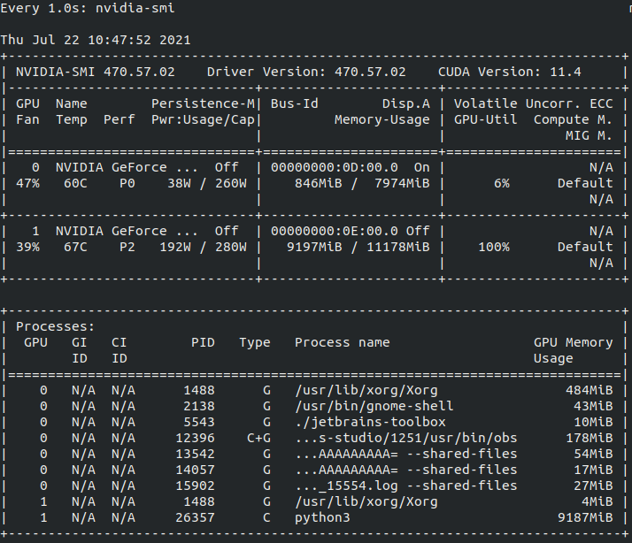

# SEM-PCYC

[PyTorch](https://pytorch.org/) | [Arxiv](https://arxiv.org/abs/1903.03372)


PyTorch implementation of our SEM-PCYC model for zero-shot sketch-based image retrieval:  
[Semantically Tied Paired Cycle Consistency for Zero-Shot Sketch-based Image Retrieval](https://arxiv.org/abs/1903.03372)  
[Anjan Dutta](https://sites.google.com/site/2adutta/)
, [Zeynep Akata](https://ivi.fnwi.uva.nl/uvaboschdeltalab/people/zeynep-akata/)  
[CVPR, 2019](http://cvpr2019.thecvf.com/)
## 개발환경 정리
|Train|Test|Ubuntu|  GPU      |  Driver |  Cuda |Conda |Python|Pytorch|torchvision|
|----|----|------|--------   |---------|-------|------|------|-------|-----------|
|성공 |성공 |18.04 | 1080 Ti   |470.57.02|11.4   |4.7.12|3.6.13|1.4.0  py3.6_cuda9.2.148_cuddn7.6.3_0|0.5.0| 
|성공 |성공 |18.04 | 2070 SUPER|470.57.02|11.4   |4.7.12|3.6.13|1.4.0 py3.6_cuda9.2.148_cuddn7.6.3_0|0.5.0|
|성공 |성공 |20.04 | 1660 SUPER|470.57.02|11.4   |4.7.12|3.6.10|1.7.1 py3.6_cuda9.2.148_cuddn7.6.3_0|0.8.2|


## Prerequisites

+ Ubuntu
  * Ubuntu 18.04 (Tested) 
  * Ubuntu 20.04 (Tested)
+ NVIDIA GPU 
  * NVIDIA GeForce GTX 1080 Ti (Tested)
  * NVIDIA GeForce RTX 2070 SUPER (Tested)
+ CUDA Version
  * 11.4 (Ubuntu Nvidia 독점 Driver Version: 470.57.02 (Tested))
+ 7z 
+ conda install (ref : https://dambi-ml.tistory.com/6)
```bash
sudo apt-get install p7zip-full
```
* rename package 설치
```bash
sudo apt-get install -y rename
```

*

```bash
conda install _pytorch_select 
```

## 가상환경 생성
- 참고 https://varhowto.com/install-pytorch-1-4-0/
```bash
conda create --name 가상환경이름(ex.torch)
conda activate 가상환경이름(ex.torch)
conda install pytorch==1.4.0 torchvision==0.5.0 cudatoolkit=10.1 -c pytorch
```
```
 conda list | grep torch
pytorch                   1.4.0           py3.6_cuda10.1.243_cudnn7.6.3_0    pytorch
torchvision               0.2.2.post3              pypi_0    pypi
```
* 필요 패키지 설치

- torch
- torchvision
- numpy
- scikit-learn
- google ( 데이터를 온라인 다운로드 받을 경우 사용, 로컬에 저장해서 사용할때는 필요 없음 )
- tqdm

```bash
pip install --upgrade google-api-python-client
```

- pytorch 설치 (ref :https://varhowto.com/install-pytorch-cuda-9-2/)

```bash 
conda uninstall pytorch torchvision cudatoolkit=11.0 -c pytorch
conda install pytorch torchvision cudatoolkit=9.2 -c pytorch
```


## Getting Started

### Installation

* Clone this repository

```bash
git clone https://github.com/AnjanDutta/sem-pcyc.git
cd sem-pcyc

```
* Update [config.ini](https://github.com/AnjanDutta/sem-pcyc/blob/master/config.ini) (see example)
```bash
[<host>]
path_dataset = <where all the datasets will be downloaded>
path_aux = <where all the auxiliary folders and files will be saved>
```
### Download datasets

* TU-Berlin
```bash
#download_datasets.sh
Sketcy dataset 부분은 주석처리
```

```bash
bash download_datasets.sh
```
OR
```bash
# code 실행 불가 경우
나스 toonsquare/개발관련/deeptoon/sem-pcyc/data/newnew 에 TU-Berlin.zip 가져오기 
```
### Download pretrained models
* Sketchy
    * sketch
    * image
    * hieremb-jcn + word2vec-google-news
* TU-Berlin
    * sketch
    * image
    * hieremb-path + word2vec-google-news
```bash
bash download_models.sh
```
OR
```bash
# code 실행 불가 경우
나스 toonsquare/개발관련/deeptoon/sem-pcyc/pretrained-model에서 가져오기 
```

### Test

##### TU-Berlin

```bash
python3 src/test.py --dataset TU-Berlin --dim-out 64 --semantic-models hieremb-path word2vec-google-news
```

- hieremb-path-word2vec-google-news : Checkpoints폴더 내에 존재하는 pretrained model
- semantic-models 뒤 옵션 수정해서 직접 train한 모델 test 가능
- test 시 CUDA memory에 따라 batch size 변경 필요

example.

```bash
python3 src/test.py --dataset TU-Berlin --dim-out 64 --semantic-models hieremb-path word2vec-google-news --batch-size 64
```

- test 결과 이미지로 확인하기 위해
- sem-pcyc/src/utils.py에 맨 윗줄에 아래코드 추가

```bash
from PIL import Image
```

- save-image-results 옵션 활용

example.

```bash
python3 src/test.py --dataset TU-Berlin --dim-out 64 --semantic-models hieremb-path word2vec-google-news --batch-size 64 --save-image-results
```

Multi gpu 중 지정해서 테스트

```
CUDA_VISIBLE_DEVICES=0,1 python3 src/test.py --dataset TU-Berlin --dim-out 64 --semantic-models hieremb-path word2vec-google-news --batch-size 64 --save-image-results
```

### Train

##### TU-Berlin

```bash
python3 src/train.py --dataset TU-Berlin --dim-out 64 --semantic-models word2vec-google-news --epochs 1000 --early-stop 200 --lr 0.0001
```

- train 시 CUDA memory에 따라 batch size 변경 필요
- CUDA_VISIBLE_DEVICES=1 뜻은 GPU 0 번(1080 Super), 1 번(2080TI) 사용시 1번 사용고 싶을 때 사


example.

```bash
python3 src/train.py --dataset TU-Berlin --dim-out 64 --semantic-models word2vec-google-news --epochs 1000 --early-stop 200 --lr 0.0001 --batch-size 64
```

Multi gpu 중 지정해서 학습 시키기

```
CUDA_VISIBLE_DEVICES=0,1 python src/train.py --dataset TU-Berlin --dim-out 64 --semantic-models word2vec-google-news --epochs 1000 --early-stop 200 --lr 0.0001 --ngpu 2 --batch-size 64
```

### Citation

```
@inproceedings{Dutta2019SEMPCYC,
author = {Anjan Dutta and Zeynep Akata},
title = {Semantically Tied Paired Cycle Consistency for Zero-Shot Sketch-based Image Retrieval},
booktitle = {CVPR},
year = {2019}
}
```

### Train 시 저장될 폴더

path_sketch_model

```
/ml_data/sem_pcyc/aux/CheckPoints/TU-Berlin/sketch
```

path_image_model

```
/ml_data/sem_pcyc/aux/CheckPoints/TU-Berlin/image
```

path_cp

```
/ml_data/sem_pcyc/aux/CheckPoints/TU-Berlin/word2vec-google-news/64
```

### NIPA
/etc/hosts 에 아래 와 같이 추가
```
49.50.175.252 nipa
```


# Start serving

## Images embedding
/src/mk_image_emb_npy.py 파일을 사용하여 images_embedding.npy 파일 생성


## Make mar file
```
torch-model-archiver --model-name sem_pcyc --version 1.0 --model-file ./src/models.py --serialized-file ./model_best.pth --extra-files ./images_embedding.npy --handler ./ts/torch_handler/sem_pcyc_handler.py
```
### Option explain
- --model-name : 모델 이름
- --model-file : 모델 아카이브할때 필요한 클래스와 함수가 저장된 파일
- --serialized-file : 모델의 가중치가 저장된 pth파일
- --extra-files : 필요한 추가적인 파일, images_embedding.npy의 파일명과 경로가 handler에서 npy가져올때 사용하는 파일명과 경로가 같게 설정해야한다
- --handler : handler file
- 추가적인 옵션은 https://github.com/pytorch/serve/blob/master/model-archiver/README.md 참고

## Torchserve start
```
torchserve --ts-config ./ts/config.properties --foreground --start --model-store ./model-store --models sem_pcyc=sem_pcyc.mar
```
옵션은 https://github.com/pytorch/serve 참고
 
## Production

### pytorch serving article
- https://pytorch.org/serve/index.html
- https://towardsdatascience.com/how-to-deploy-your-pytorch-models-with-torchserve-2452163871d3


Docker 로 torchserver 실행방법
```
docker run --rm -it --gpus all -p 8080:8080 -p 8081:8081 --name mar -v $(pwd)/model-store:/home/model-server/model-store -v $(pwd)/examples:/home/model-server/examples  pytorch/torchserve:latest torchserve --start --model-store /home/model-server/model-store --models densenet161=densenet161.mar
```

## Author

* [Anjan Dutta](https://sites.google.com/site/2adutta/) ([@AnjanDutta](https://github.com/AnjanDutta))


### Reference
https://neptune.ai/blog/6-gan-architectures
https://eehoeskrap.tistory.com/430